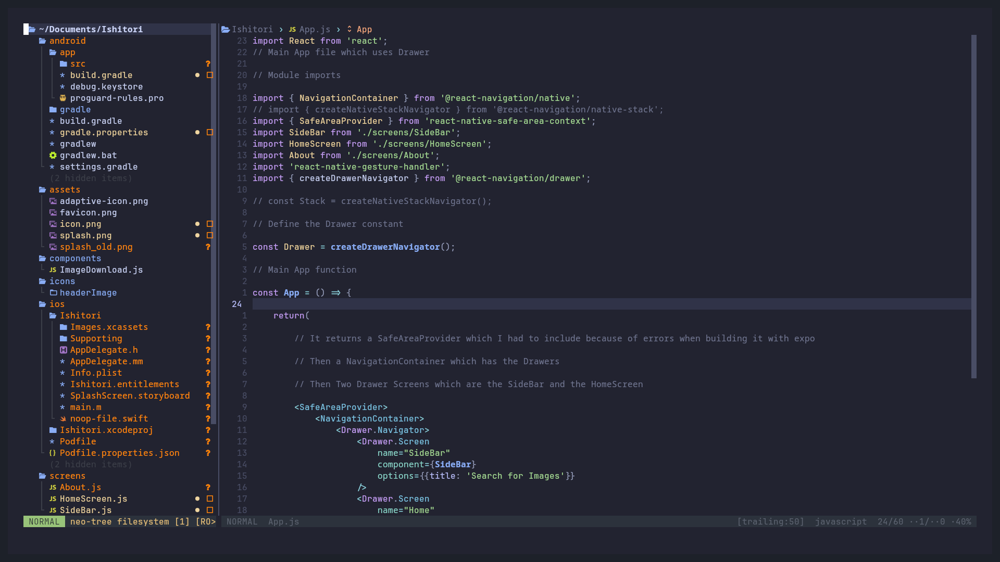

# PrettyVim

A pretty [Neovim](https://github.com/neovim/neovim) Configuration with the packer package manager

## Screenshots



## Plugins

- packer - The Package Installer
- plenary - For the Lua functions that many of my plugins use
- nvim-web-devicons - icons for the file expolorer
- nui - UI library for Neovim
- catppuccin - Coloscheme used for Neovim
- vim-surround - Adding , deleting, changing things when they are inside of quotes
- vim-ReplaceWithRegister - Replace contents with motion
- Comment.nvim - A shortcut to comment (Using gc)
- nvim-hardline - Statusline or Bar
- dashboard - startup screen
- telescope - telescope plugin
- nvim.cmp and cmp-buffer and cmp-path - Auto completion
- LuaSnip and cmp_luasnip and friendly-snippets - Code snippets
- mason - Managing & installing of lsp servers
- nvim-lspconfig and cmp-nvim-lsp and lspsaga.nvim and typescript.nvim and lspkind.nvim - For configuraing lsp servers
- SmoothCursor - Smooth cursor animation Neovim
- nvim-scrollview - Scroll bar for Neovim
- web-tools - Plugin for Web development in Neovim
- tree-sitter - Syntax Highlighting
- presence.nvim - Discord Rich Presence (you want to show off to others what you are using)
- toggleterm - Togglable terminal for Neovim

## Requirements

- Neovim

## Usage

1. Clone the repo

```
git clone git@github.com:SakuraBlossomTree/neovim-config.git
```

2. Create the nvim config directory(Optional)

If you don't find a nvim config directory, just create one using this command

If you already have the nvim config directory, you can skip this steip

```
mkdir ~/.config/nvim
```

2. Copy the one directory and one file which are there

- lua/sakurablossomtree directory
- init.lua file

It is not required to copy the plugin directory because it just contains the packer manager compiled stuff

You want to copy it to your config folder for nvim

```
cp -r ~/PrettyVim/lua ~/.config/nvim
cp -r ~/PrettyVim/init.lua ~/.config/nvim
```

3. Go to plugins-setup.lua file, which will be in the lua/sakurablossomtree directory

Open the file using Neovim run the command ```:PackerSync``` to install and sync packer, after that anytime you want to update the plugins or intall some new ones just open the file again and add the plugin and write the file using the command ```:w```

4. Enjoy the PrettyVim
